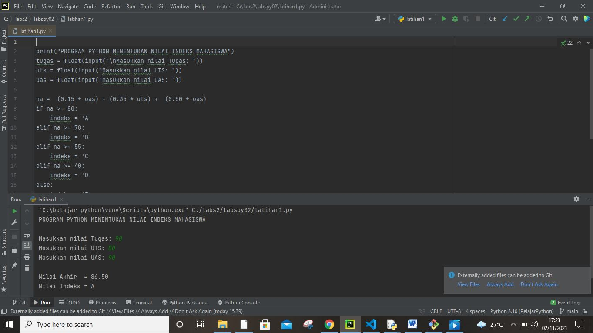

# labspy02
## Buat program sederhana dengan input tiga buah bilangan
### Inilah programnnya

Program di atas menggunakan percabangan IF dengan beberapa kondisi sesuai dengan aturan skala nilai indeks.

Nilai indeks mahasiswa di tentukan dari skor nilai akhir yang di peroleh mahasiswa lewat 3 komponen penilaian yaitu:

Nilai tugas sebesar 15%
Nilai UTS sebesar 35%
Nilai UAS sebesar 50%'
'

1.PROGRAMNYA:'
'

Pada program dibawah,Kita membahas tentang membuat program perhitungan nilai mahasiswa.Dari Nilai ujian akhir semester(UAS),nilai ujian tengah semester(UTS),dan Nilai Tugas,yang dapat menyatakan seorang mahasiswa Lulus atau Tidak Lulus,serta mendapatkan sebuah nilai berupa huruf/grade.

Proses inputnya adalah:

- Apabila total nilai akhir mahasiswa >= 60 maka akan di nyatakan "LULUS" dan jika <=60 maka akan di nyatakan "TIDAK LULUS"
- Apabila nilai Akhir mahasiswa >=88 Maka akan mendapat nilai A,>=70 Maka akan mendapat nilai C,>=5 mendapat nilai D dan selainnya mendapat nilai E.

Proses Inputnya adalah:
Nama mahasiswa
Nim mahasiswa
Nilai UTS
Nilai UAS
Nilai Tugas
Proses outputnya adalah:
Keterangan
Nilai Akhir'
'

2. FLOWCHART'
'

Uas dilaksanakan maka diperoleh nilai akhir mahasiswa. nilai akhir(Na), diperoleh dari jumalah nilai uas, nilai uts, nilai tugas, adapun  bobot masing-masing nilai adalah nilai tugas 30%, nilai uts 30%, dan nilai uas 40%.
Berdasarkan nilai akhir, tentukan kriteria nilai akhir sebagai berikut:
jika Na >=85 maka kriteria A
jika Na<=80 Na<=84 maka kriteria AB
jika Na<=70 Na<=80 maka Kriteria  B
jika Na<=65 Na<=70 maka Kriteria BC
jika Na<=55 Na<=65 maka Kriteria C
jika Na<=40 Na<=55 maka Kriteria D
jika Na <=40 maka kriteria E
input : nama mahasiswa, nim, nama, mata kuliah, nilai tugas, nilai uts, nilai uas.'
'

